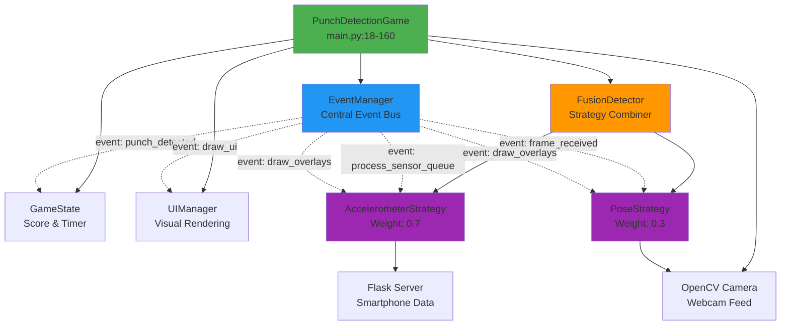

## Slide 1: System Overview - Main Architecture

### **PunchDetectionGame Class**

The central orchestrator that coordinates all game components through an event-driven architecture.

### **Core Components** (main.py:19-36)

```
EventManager → Central event bus for component communication
GameState → Manages scoring, combos, timing, and game lifecycle
UIManager → Handles visual rendering and effects
FusionDetector → Combines multiple detection strategies
Detection Strategies → AccelerometerStrategy + PoseStrategy
```

### **Key Design Patterns**

- **Event-Driven Architecture**: All components communicate via EventManager
- **Strategy Pattern**: Pluggable detection strategies with weighted fusion (70% accel, 30% pose)
- **Separation of Concerns**: Detection ↔ Game Logic ↔ UI are independent

---

## Slide 2: Architecture Diagram


