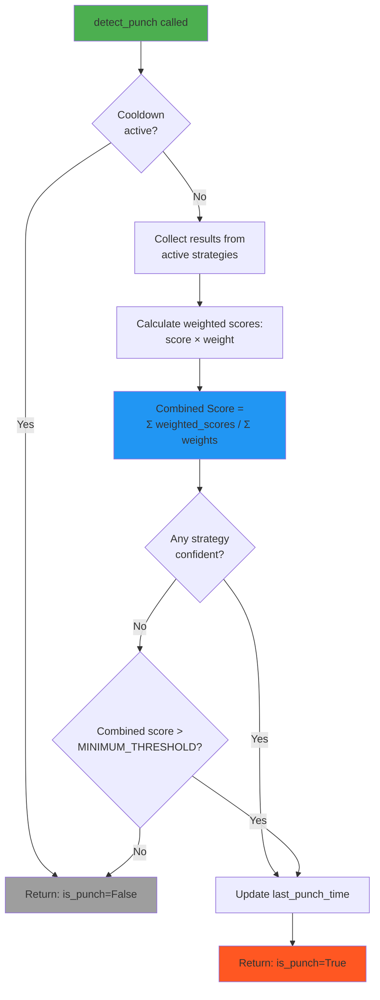
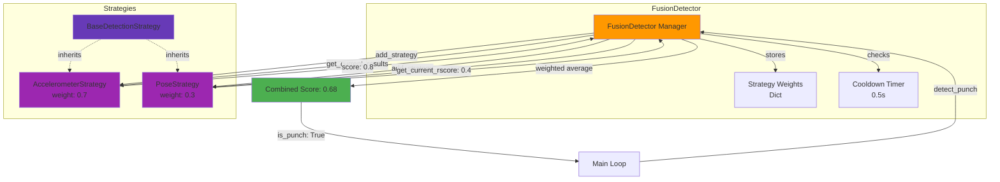

## Slide 5: FusionDetector - Strategy Combiner

### **Purpose** (fusion_detector.py:13-17)

Orchestrates multiple detection strategies and combines their results using **weighted fusion** to determine if a punch occurred.

### **Core Responsibilities**

1. **Strategy Management** (lines 40-83)

   - Add/remove strategies dynamically
   - Assign weights to each strategy
   - Query strategies by name

2. **Weighted Fusion** (lines 85-136)

   - Collect results from active strategies
   - Calculate weighted average score
   - Apply punch detection logic
   - Enforce cooldown period (0.5s default)

3. **Punch Detection Logic** (lines 137-160)
   - **Primary**: If ANY strategy is confident → Punch detected
   - **Fallback**: If combined score > MINIMUM_COMBINED_SCORE → Punch detected

---

## Slide 6: Fusion Algorithm Flowchart



---

## Slide 7: Strategy Pattern - BaseDetectionStrategy

### **Abstract Interface** (base_strategy.py:6-115)

All detection strategies inherit from this base class and implement:

| Method                  | Purpose                                                    | Required           |
| ----------------------- | ---------------------------------------------------------- | ------------------ |
| `register_hooks()`      | Subscribe to events (setup, cleanup, frame_received, etc.) | ✓ Required         |
| `setup()`               | Initialize resources (MediaPipe, Flask server, etc.)       | Override           |
| `cleanup()`             | Release resources                                          | Override           |
| `get_current_results()` | Return latest detection results as dict                    | ✓ Called by Fusion |

### **Strategy Result Format**

Each strategy returns a dictionary:

```python
{
    'score': 0.0-1.0,           # Confidence score
    'is_confident': bool,        # High-confidence detection flag
    'metrics': {...},            # Strategy-specific data
    # ... additional fields
}
```

### **Lifecycle** (lines 58-92)

```
Inactive → setup() → Active → cleanup() → Inactive
         (on 'setup' event)   (on 'cleanup' event)
```

---

## Slide 8: Strategy Registration & Weighting

### **From main.py** (lines 41-54)

```python
# Initialize strategies
accelerometer_strategy = AccelerometerStrategy(...)
pose_strategy = PoseStrategy(...)

# Register with weights (must sum to 1.0)
fusion_detector.add_strategy(accelerometer_strategy, weight=0.7)  # 70%
fusion_detector.add_strategy(pose_strategy, weight=0.3)           # 30%
```

### **Weighted Fusion Example** (fusion_detector.py:110-124)

```
Scenario: Both strategies active
├─ AccelerometerStrategy: score=0.8, weight=0.7 → weighted=0.56
├─ PoseStrategy: score=0.4, weight=0.3 → weighted=0.12
└─ Combined Score = (0.56 + 0.12) / 1.0 = 0.68
```

### **Why Weighted Fusion?**

- **Accelerometer (70%)**: More reliable for detecting punch force/acceleration
- **Pose (30%)**: Provides visual confirmation of arm movement
- **Configurable**: Weights can be adjusted in `detection_config.py`

---

## Slide 9: FusionDetector Architecture Diagram


