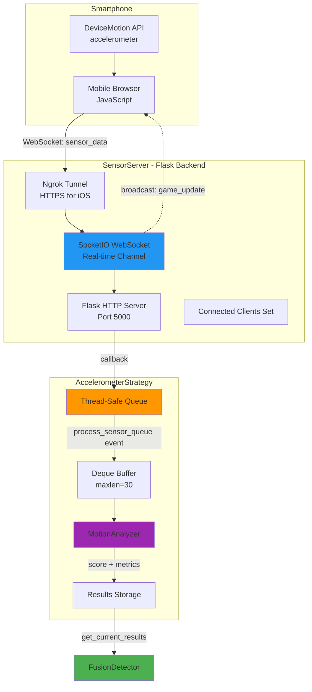

## Slide 10: AccelerometerStrategy - Smartphone Sensor Detection

### **Purpose** (accelerometer_strategy.py:30-36)

Manages Flask/SocketIO server lifecycle, receives real-time sensor data from smartphones, and analyzes motion for punch detection.

### **Core Components**

```
1. SensorServer (Flask + SocketIO)
   └─ WebSocket server for real-time sensor data streaming

2. MotionAnalyzer
   └─ Analyzes acceleration magnitude for punch detection

3. Sensor Queue & Buffer
   └─ Thread-safe queue + deque buffer (maxlen=30)
```

### **Weight in Fusion**: **70%** (primary detection method)

---

## Slide 11: AccelerometerStrategy Architecture



---

## Slide 12: Data Flow - Smartphone to Detection

### **1. Server Initialization** (accelerometer_strategy.py:68-96)

```python
setup_server() event:
  ├─ Create MotionAnalyzer(threshold=15.0 m/s²)
  ├─ Create SensorServer
  │   ├─ Flask app + SocketIO on 0.0.0.0:5000
  │   ├─ Setup ngrok HTTPS tunnel (iOS requirement)
  │   ├─ Display QR code in terminal
  │   └─ Start in daemon thread
  └─ Activate strategy
```

### **2. Client Connection** (sensor_server.py:60-70)

```python
Smartphone opens URL → WebSocket connect
  ├─ Add to connected_clients set
  ├─ Emit initial game state (score, combo, punches)
  └─ Ready to receive sensor_data events
```

### **3. Sensor Data Stream** (accelerometer_strategy.py:114-169)

```python
Every frame:
  ├─ process_sensor_queue event triggered
  ├─ Drain queue into buffer
  ├─ MotionAnalyzer.analyze_accelerometer_punch()
  │   ├─ Calculate magnitude: √(x² + y² + z²)
  │   ├─ Remove gravity: |magnitude - 9.81|
  │   ├─ Check threshold: magnitude_no_gravity > 15.0
  │   └─ Normalize score: min(magnitude / 50.0, 1.0)
  └─ Update strategy results
```

---

## Slide 13: Motion Analysis Algorithm

### **MotionAnalyzer** (motion_analyzer.py:17-53)

```mermaid
flowchart TD
    Start[Sensor Data<br/>x, y, z]
    Mag[Calculate Magnitude<br/>√x² + y² + z²]
    Gravity[Remove Gravity<br/>|mag - 9.81|]
    Threshold{magnitude ><br/>15.0 m/s²?}
    Score[Calculate Score<br/>min mag/50.0, 1.0]
    NoScore[Score = 0]
    Return[Return score, metrics]

    Start --> Mag
    Mag --> Gravity
    Gravity --> Threshold
    Threshold -->|Yes| Score
    Threshold -->|No| NoScore
    Score --> Return
    NoScore --> Return

    style Start fill:#4CAF50
    style Score fill:#FF9800
    style Threshold fill:#2196F3
```

### **Threshold Logic**

- **ACCEL_PUNCH_THRESHOLD**: 15.0 m/s² (after gravity removal)
- **ACCEL_SCORING_MAX**: 50.0 m/s² (maximum for normalization)
- **Confident Detection**: `score > ACCEL_PUNCH_THRESHOLD`

### **Example Calculation**

```
Sensor data: x=2.5, y=18.3, z=9.1 m/s²
├─ Magnitude = √(2.5² + 18.3² + 9.1²) = 20.8 m/s²
├─ No gravity = |20.8 - 9.81| = 11.0 m/s² (below threshold)
└─ Score = 0 (not a punch)

Sensor data: x=5.2, y=32.7, z=14.6 m/s²
├─ Magnitude = √(5.2² + 32.7² + 14.6²) = 36.5 m/s²
├─ No gravity = |36.5 - 9.81| = 26.7 m/s² (above threshold!)
└─ Score = min(26.7/50.0, 1.0) = 0.534 (punch detected!)
```

---

## Slide 14: Event Hooks & Lifecycle

### **Registered Event Hooks** (accelerometer_strategy.py:60-66)

| Event                  | Handler                      | Purpose                                        |
| ---------------------- | ---------------------------- | ---------------------------------------------- |
| `setup`                | `setup_server()`             | Initialize Flask server, ngrok, MotionAnalyzer |
| `process_sensor_queue` | `process_sensor_queue()`     | Drain queue, analyze latest data               |
| `game_state_changed`   | `handle_game_state_update()` | Broadcast score/combo to smartphone            |
| `draw_ui`              | `draw_strategy_ui()`         | Draw connection status + accel magnitude       |
| `cleanup`              | `cleanup_server()`           | Deactivate strategy, clear data                |

### **Real-Time Feedback** (accelerometer_strategy.py:170-181)

```python
When punch registered:
  main.py triggers 'game_state_changed' event
  ├─ AccelerometerStrategy.handle_game_state_update()
  ├─ SensorServer.emit_game_update()
  └─ Smartphone receives updated score/combo via WebSocket
```

---

## Slide 15: SensorServer - WebSocket Communication

### **Key Features** (sensor_server.py:11-213)

1. **Flask + SocketIO** (lines 27-37)

   - HTTP server for static HTML page
   - WebSocket for real-time bidirectional communication
   - CORS enabled for cross-origin access

2. **Ngrok HTTPS Tunnel** (lines 102-131)

   - iOS requires HTTPS for DeviceMotion API
   - Auto-generates QR code in terminal
   - Falls back to local network if unavailable

3. **WebSocket Events**
   | Client → Server | Server → Client |
   |----------------|-----------------|
   | `connect` | `status` (initial game state) |
   | `sensor_data` | `sensor_ack` (acknowledgment) |
   | `get_status` | `game_update` (score/combo) |
   | `disconnect` | - |

4. **Thread Safety** (lines 50-51, 165)
   - Server runs in **daemon thread**
   - Sensor data passed via **callback → Queue**
   - Main thread processes queue asynchronously

---

## Slide 16: Smartphone Interface

### **HTML/JavaScript Client** (templates/index.html - implied)

```javascript
// DeviceMotion API
window.addEventListener("devicemotion", (event) => {
  const data = {
    x: event.accelerationIncludingGravity.x,
    y: event.accelerationIncludingGravity.y,
    z: event.accelerationIncludingGravity.z,
    timestamp: Date.now(),
  };

  socket.emit("sensor_data", data);
});

// Receive game updates
socket.on("game_update", (state) => {
  updateScoreDisplay(state.score, state.combo);
});
```

### **Connection Flow**

```
1. User scans QR code or enters URL
2. Browser requests HTTPS permission for sensors
3. WebSocket connection established
4. Server sends initial game state
5. JavaScript starts streaming accelerometer data (60Hz typical)
6. Real-time score updates displayed on phone
```

---
