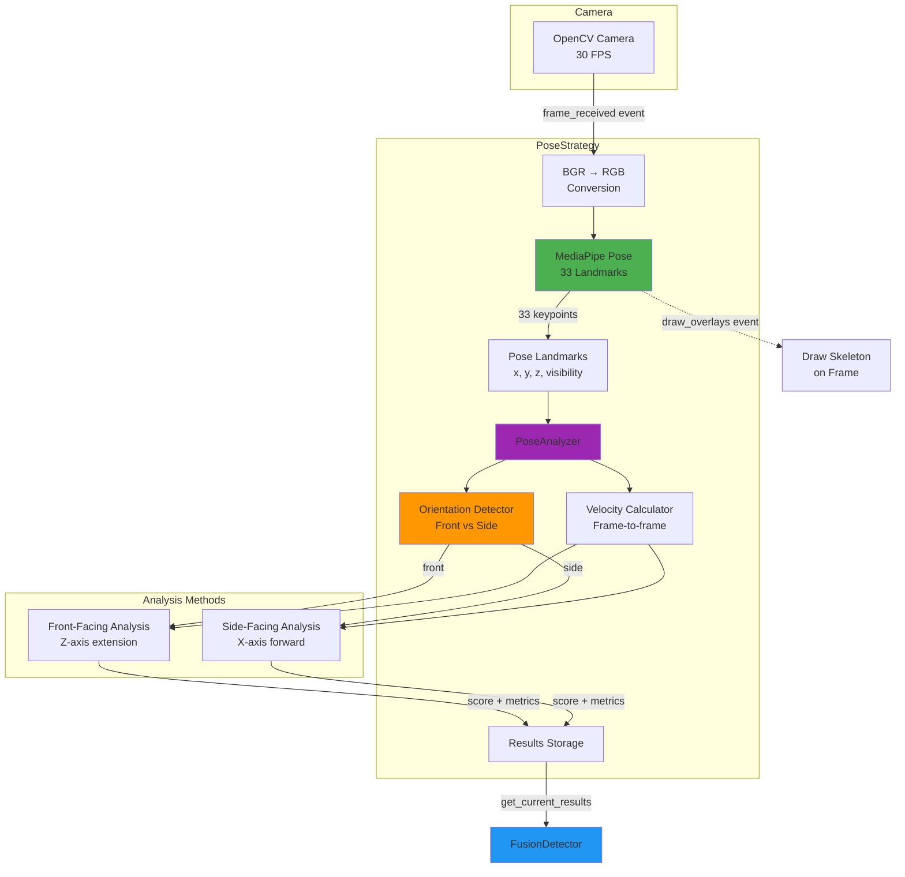
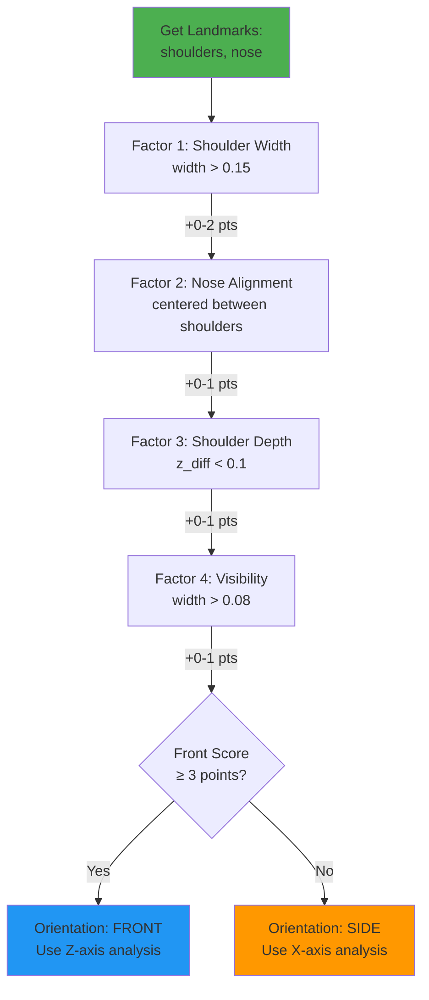
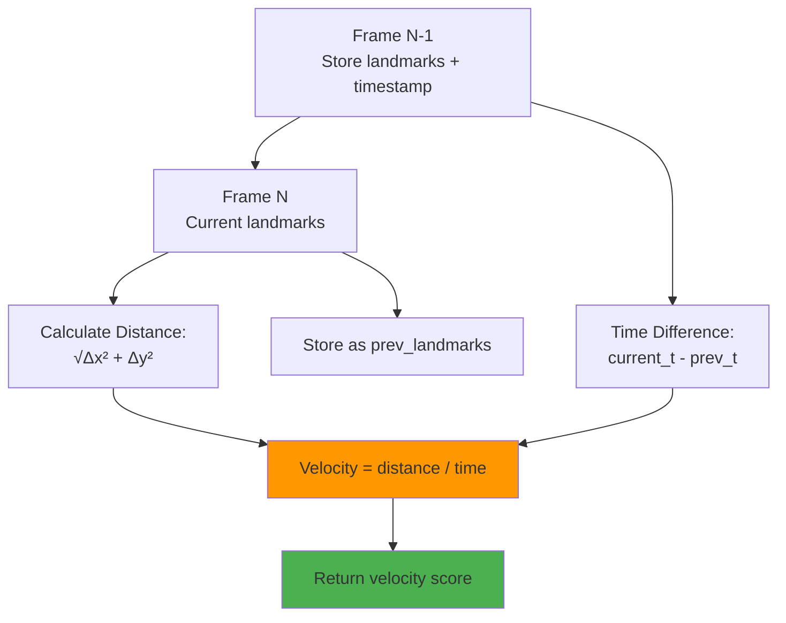

## Slide 17: PoseStrategy - Computer Vision Detection

### **Purpose** (pose_strategy.py:22-29)

Manages MediaPipe pose detection lifecycle, processes camera frames for body pose landmarks, and analyzes arm movements for punch detection.

### **Core Components**

```
1. MediaPipe Pose
   └─ Real-time body pose landmark detection (33 keypoints)

2. PoseAnalyzer
   └─ Analyzes landmark positions and velocities for punch movements

3. Orientation Detection
   └─ Adapts analysis based on user facing front or side
```

### **Weight in Fusion**: **30%** (supplementary visual confirmation)

---

## Slide 18: PoseStrategy Architecture



---

## Slide 19: MediaPipe Pose Landmarks

### **33-Point Body Model** (pose_strategy.py:61-67)

```python
MediaPipe Pose Configuration:
├─ model_complexity: 1 (balance speed/accuracy)
├─ min_detection_confidence: 0.5
├─ min_tracking_confidence: 0.5
├─ enable_segmentation: False (not needed)
└─ static_image_mode: False (video tracking)
```

### **Key Landmarks Used**

| Landmark                      | Purpose                                |
| ----------------------------- | -------------------------------------- |
| LEFT_WRIST, RIGHT_WRIST       | Track fist position                    |
| LEFT_SHOULDER, RIGHT_SHOULDER | Reference points for extension         |
| LEFT_ELBOW, RIGHT_ELBOW       | Arm angle calculation                  |
| NOSE                          | Orientation detection (face direction) |

### **Landmark Data Structure**

```python
landmark = {
    'x': 0.0-1.0,          # Horizontal position (normalized)
    'y': 0.0-1.0,          # Vertical position (normalized)
    'z': float,            # Depth relative to hip center
    'visibility': 0.0-1.0  # Confidence landmark is visible
}
```

---

## Slide 20: Data Flow - Frame to Detection

### **1. MediaPipe Initialization** (pose_strategy.py:55-77)

```python
setup_mediapipe() event:
  ├─ Initialize MediaPipe Pose model
  ├─ Create PoseAnalyzer instance
  └─ Activate strategy
```

### **2. Frame Processing** (pose_strategy.py:98-156)

```python
Every frame:
  ├─ frame_received event triggered with OpenCV frame
  ├─ Convert BGR → RGB (MediaPipe requirement)
  ├─ MediaPipe.process() → Extract 33 landmarks
  ├─ If landmarks detected:
  │   ├─ PoseAnalyzer.analyze_pose_punch()
  │   │   ├─ Detect orientation (front/side)
  │   │   ├─ Calculate arm extension
  │   │   ├─ Calculate wrist velocity
  │   │   └─ Apply orientation-specific analysis
  │   └─ Update strategy results
  └─ Else: Return score=0, is_confident=False
```

### **3. Landmark Visualization** (pose_strategy.py:158-176)

```python
draw_overlays event:
  ├─ If landmarks available
  ├─ MediaPipe.draw_landmarks()
  └─ Draw skeleton with connections on frame
```

---

## Slide 21: Orientation Detection Algorithm

### **Multi-Factor Scoring System** (pose_analyzer.py:90-136)



### **Why Orientation Matters**

- **Front-Facing**: Wrist moves toward camera (Z-axis), X/Y movement = noise
- **Side-Facing**: Wrist moves laterally (X-axis), Z-axis less reliable

---

## Slide 22: Front-Facing Punch Analysis

### **Z-Axis Extension Velocity** (pose_analyzer.py:227-264)

**Key Insight**: When facing camera, punches extend toward lens → decreasing Z value

```python
Algorithm:
1. Calculate Punch Extension
   ├─ current_extension = wrist.z - shoulder.z
   ├─ Negative = wrist forward of shoulder
   └─ Change in extension = punch velocity

2. Calculate Extension Velocity
   ├─ extension_change = |current_z - previous_z|
   ├─ velocity = extension_change / time_diff
   └─ Smooth with 3-frame history

3. Movement Filtering
   ├─ lateral_filter = penalize excessive X movement
   ├─ vertical_filter = penalize excessive Y movement
   └─ Clean punches have minimal X/Y noise

4. Score Calculation
   ├─ extension_score = min(velocity / 3.0, 1.0)
   ├─ Apply X/Y movement filter
   └─ filtered_score = extension_score × filter × 2.0
```

### **Thresholds**

- **PUNCH_VELOCITY_THRESHOLD**: 3.0 (normalized units/sec)
- **FRONT_VELOCITY_MULTIPLIER**: 2.0 (boost front detection)
- **Movement Filter**: Reduces score if lateral/vertical > 0.15

---

## Slide 23: Side-Facing Punch Analysis

### **X-Axis Forward Movement** (pose_analyzer.py:266-294)

**Key Insight**: When facing sideways, punches move across frame → X-axis change

```python
Algorithm:
1. Calculate Forward Movement
   ├─ forward_distance = |wrist.x - shoulder.x|
   ├─ Left/right wrist checked independently
   └─ max_forward = most extended arm

2. Calculate Vertical Movement
   ├─ vertical_distance = |wrist.y - shoulder.y|
   └─ Detects uppercuts and hooks

3. Calculate Overall Velocity
   ├─ velocity = √(Δx² + Δy²) / time_diff
   └─ Based on frame-to-frame wrist position change

4. Score Calculation
   ├─ position_score = max_forward × 1.5  (emphasize forward)
   ├─ velocity_score = velocity / 3.0
   └─ final_score = 50% position + 50% velocity
```

### **Thresholds**

- **SIDE_FORWARD_MULTIPLIER**: 1.5 (boost X-axis movement)
- **Velocity threshold**: Same as front (3.0)

---

## Slide 24: Velocity Calculation

### **Frame-to-Frame Tracking** (pose_analyzer.py:138-170)



### **Implementation Details**

```python
# Per-wrist velocity calculation
left_distance = sqrt(
    (current_left_wrist.x - prev_left_wrist.x)² +
    (current_left_wrist.y - prev_left_wrist.y)²
)
right_distance = sqrt(
    (current_right_wrist.x - prev_right_wrist.x)² +
    (current_right_wrist.y - prev_right_wrist.y)²
)

time_diff = current_timestamp - prev_timestamp
velocity = max(left_distance, right_distance) / time_diff
```

**Returns**: Maximum velocity between left/right wrists (most active hand)

---

## Slide 25: Pose Analysis Scoring

### **Combined Score Formula** (pose_analyzer.py:67-68)

```python
punch_score = (
    max_extension × ARM_EXTENSION_WEIGHT +
    movement_score × FORWARD_MOVEMENT_WEIGHT
) × POSE_SCORE_MULTIPLIER

punch_score = min(punch_score, 1.0)  # Clamp to [0, 1]
```

### **Configuration Weights** (detection_config.py)

| Parameter                      | Value | Purpose                         |
| ------------------------------ | ----- | ------------------------------- |
| `POSE_ARM_EXTENSION_WEIGHT`    | 0.3   | Weight for static arm extension |
| `POSE_FORWARD_MOVEMENT_WEIGHT` | 0.7   | Weight for dynamic movement     |
| `POSE_SCORE_MULTIPLIER`        | 1.5   | Overall sensitivity boost       |
| `VISUAL_PUNCH_THRESHOLD`       | 0.6   | Confident detection threshold   |

### **Confidence Flag**

```python
is_confident = punch_score > VISUAL_PUNCH_THRESHOLD  # 0.6
```

If confident → FusionDetector registers punch immediately (bypasses combined score threshold)

---

## Slide 26: Event Hooks & Lifecycle

### **Registered Event Hooks** (pose_strategy.py:48-53)

| Event            | Handler               | Purpose                                 |
| ---------------- | --------------------- | --------------------------------------- |
| `setup`          | `setup_mediapipe()`   | Initialize MediaPipe Pose model         |
| `frame_received` | `process_frame()`     | Process webcam frame, extract landmarks |
| `draw_overlays`  | `draw_landmarks()`    | Draw pose skeleton on frame             |
| `cleanup`        | `cleanup_mediapipe()` | Release MediaPipe resources             |

### **No Direct UI Drawing**

Unlike AccelerometerStrategy, PoseStrategy does NOT hook into `draw_ui` event. Its visual feedback is purely the skeletal overlay drawn via MediaPipe's built-in renderer.

---

## Slide 27: PoseStrategy Result Format

### **Strategy Result Dictionary** (pose_strategy.py:127-138)

```python
{
    'score': 0.0-1.0,                    # Punch confidence score
    'is_confident': bool,                # score > VISUAL_PUNCH_THRESHOLD
    'metrics': {
        'left_extension': float,         # Left arm extension distance
        'right_extension': float,        # Right arm extension distance
        'max_extension': float,          # Maximum of left/right
        'movement_score': float,         # Orientation-specific movement score
        'velocity_score': float,         # Wrist velocity magnitude
        'orientation': 'front'|'side',   # Detected user orientation
        'punch_score': float             # Final computed score
    },
    'landmarks': [...],                  # 33 MediaPipe landmarks
    'pose_results': MediaPipeResults,    # Raw MediaPipe output
    'timestamp': float,                  # Unix timestamp
    'strategy': 'pose'                   # Strategy identifier
}
```

---
