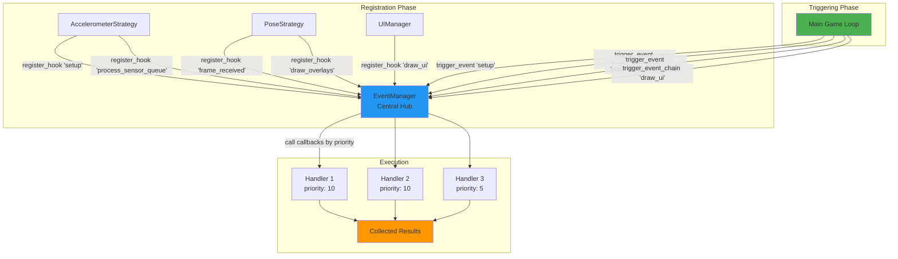
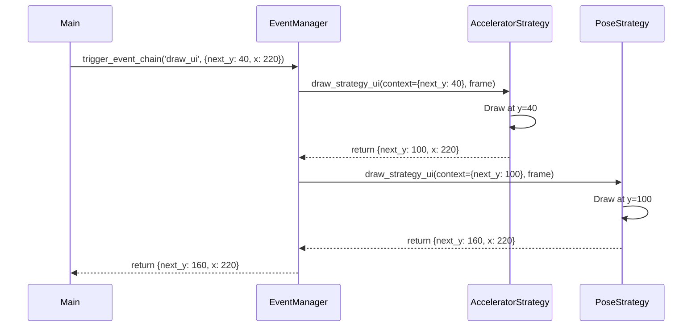

## Slide 29: EventManager - Central Event Bus

### **Purpose** (event_manager.py:5-11)

Provides a publish-subscribe (pub-sub) event system that enables loose coupling between game components. Components communicate through events rather than direct references.

### **Core Functionality**

```
1. Hook Registration
   └─ Components subscribe to events with priority

2. Event Triggering
   └─ Broadcast events to all registered listeners

3. Context Chaining
   └─ Pass mutable context through handler chain (for UI positioning)
```

### **Key Benefits**

- **Decoupling**: Components don't need references to each other
- **Extensibility**: New strategies/components can subscribe without modifying existing code
- **Priority Control**: Handlers execute in defined order
- **Error Isolation**: One handler failure doesn't break the event chain

---

## Slide 30: EventManager Architecture



---

## Slide 31: Hook Registration

### **register_hook() Method** (event_manager.py:16-27)

```python
def register_hook(self, event_name: str, callback: Callable, priority: int = 0):
    """
    Register a callback function for a specific event.

    Args:
        event_name: Name of the event to listen for
        callback: Function to call when event is triggered
        priority: Execution priority (higher numbers run first)
    """
    self.hooks[event_name].append((priority, callback))
    # Sort by priority (descending - higher priority first)
    self.hooks[event_name].sort(key=lambda x: x[0], reverse=True)
```

### **Usage Example** (from AccelerometerStrategy)

```python
class AccelerometerStrategy(BaseDetectionStrategy):
    def register_hooks(self):
        # Priority 10 = runs before priority 0
        self.event_manager.register_hook('setup', self.setup_server, priority=10)
        self.event_manager.register_hook('process_sensor_queue',
                                         self.process_sensor_queue, priority=10)
        self.event_manager.register_hook('cleanup', self.cleanup_server, priority=10)
```

### **Priority System**

- **Higher numbers execute first** (descending order)
- All strategies use `priority=10` (executed before default priority 0)
- Ensures strategies initialize before other components

---

## Slide 32: Event Triggering - Standard Mode

### **trigger_event() Method** (event_manager.py:49-72)

```python
def trigger_event(self, event_name: str, *args, **kwargs) -> List[Any]:
    """Execute all callbacks registered for an event."""
    results = []

    for priority, callback in self.hooks[event_name]:
        try:
            result = callback(*args, **kwargs)
            results.append(result)
        except Exception as e:
            print(f"Error in event callback for '{event_name}': {e}")
            results.append(None)  # Continue despite error

    return results
```

### **Key Features**

1. **Broadcasts to all listeners**: Every registered callback is called
2. **Error isolation**: Exception in one handler doesn't stop others
3. **Result collection**: Returns list of all callback return values
4. **Flexible arguments**: Passes \*args and \*\*kwargs to all handlers

### **Usage Example** (from main.py)

```python
# Broadcast frame to all strategies
self.event_manager.trigger_event('frame_received', frame)

# Trigger sensor processing
self.event_manager.trigger_event('process_sensor_queue')

# Notify game state change
self.event_manager.trigger_event('game_state_changed', game_state_dict)
```

---

## Slide 33: Event Triggering - Chain Mode

### **trigger_event_chain() Method** (event_manager.py:109-138)

```python
def trigger_event_chain(self, event_name: str, initial_context: dict,
                        *args, **kwargs) -> dict:
    """
    Execute callbacks in chain, passing accumulated context to each handler.
    Each callback can update the context for the next handler.
    """
    context = initial_context.copy()

    for priority, callback in self.hooks[event_name]:
        try:
            result = callback(context, *args, **kwargs)
            # If callback returns a dict, merge it into context
            if isinstance(result, dict):
                context.update(result)
        except Exception as e:
            print(f"Error in event callback for '{event_name}': {e}")

    return context
```

### **Use Case: UI Positioning Chain**

```python
# Initial context with starting position
draw_context = {'next_y': 40, 'x': 220}

# Each strategy draws and updates next_y for the next handler
self.event_manager.trigger_event_chain('draw_ui', draw_context, frame)
```



---

## Slide 34: Event Flow Examples

### **Setup Event** (game initialization)

```
trigger_event('setup')
  ├─ AccelerometerStrategy.setup_server()
  │   ├─ Initialize MotionAnalyzer
  │   ├─ Start Flask SensorServer
  │   └─ Activate strategy
  ├─ PoseStrategy.setup_mediapipe()
  │   ├─ Initialize MediaPipe Pose
  │   ├─ Create PoseAnalyzer
  │   └─ Activate strategy
  └─ (Any other registered setup handlers)
```

### **Frame Processing Event** (every game loop iteration)

```
trigger_event('frame_received', frame)
  └─ PoseStrategy.process_frame(frame)
      ├─ Convert BGR → RGB
      ├─ MediaPipe.process()
      ├─ Extract landmarks
      ├─ Analyze for punch
      └─ Update results
```

### **Drawing Event Chain** (render phase)

```
trigger_event_chain('draw_ui', context={next_y: 40, x: 220}, frame)
  ├─ AccelerometerStrategy.draw_strategy_ui()
  │   ├─ Draw "Sensor: Connected" at y=40
  │   ├─ Draw "Accel: 12.5" at y=70
  │   └─ Return {next_y: 100, x: 220}
  └─ (Next strategy would draw at y=100)
```

---

## Slide 35: Event Catalog

### **All Events Used in Game**

| Event Name             | Trigger Location | Listeners                | Purpose                 |
| ---------------------- | ---------------- | ------------------------ | ----------------------- |
| `setup`                | main.py:78       | All strategies           | Initialize resources    |
| `frame_received`       | main.py:100      | PoseStrategy             | Process webcam frame    |
| `process_sensor_queue` | main.py:103      | AccelerometerStrategy    | Drain sensor queue      |
| `punch_detected`       | main.py:65       | (Future: sound, effects) | React to punch          |
| `game_state_changed`   | main.py:71       | AccelerometerStrategy    | Broadcast to smartphone |
| `draw_overlays`        | main.py:118      | PoseStrategy             | Draw MediaPipe skeleton |
| `draw_ui`              | main.py:125      | AccelerometerStrategy    | Draw strategy metrics   |
| `cleanup`              | main.py:153      | All strategies           | Release resources       |

### **Event Types by Pattern**

- **Broadcast Events**: `setup`, `frame_received`, `process_sensor_queue`, `cleanup`

  - Use `trigger_event()`
  - All listeners execute independently

- **Chain Events**: `draw_ui`
  - Use `trigger_event_chain()`
  - Context passes between handlers sequentially

---

## Slide 36: Error Handling & Resilience

### **Fault Tolerance** (event_manager.py:64-70, 129-136)

```python
try:
    result = callback(*args, **kwargs)
    results.append(result)
except Exception as e:
    print(f"Error in event callback for '{event_name}': {e}")
    results.append(None)  # Continue despite error
```

### **Benefits**

1. **Isolation**: One handler crash doesn't affect others
2. **Debugging**: Errors are logged with event name
3. **Graceful Degradation**: Game continues even if a strategy fails
4. **Development Safety**: New strategies can be tested without breaking existing system

### **Example Scenario**

```
PoseStrategy.process_frame() throws exception:
  ├─ Error logged: "Error in event callback for 'frame_received': ..."
  ├─ PoseStrategy returns None
  ├─ FusionDetector continues with AccelerometerStrategy only
  └─ Game remains playable (reduced detection accuracy)
```

---

## Slide 37: EventManager Implementation Details

### **Data Structure** (event_manager.py:14)

```python
self.hooks: dict[str, List[Tuple[int, Callable]]] = defaultdict(list)

# Example internal state:
{
    'setup': [
        (10, <AccelerometerStrategy.setup_server>),
        (10, <PoseStrategy.setup_mediapipe>)
    ],
    'frame_received': [
        (10, <PoseStrategy.process_frame>)
    ],
    'draw_ui': [
        (10, <AccelerometerStrategy.draw_strategy_ui>)
    ]
}
```

### **Utility Methods**

| Method              | Purpose                       | Use Case                 |
| ------------------- | ----------------------------- | ------------------------ |
| `unregister_hook()` | Remove specific callback      | Dynamic strategy removal |
| `has_listeners()`   | Check if event has handlers   | Conditional triggering   |
| `get_event_names()` | List all registered events    | Debugging, introspection |
| `clear_event()`     | Remove all handlers for event | Reset specific event     |
| `clear_all()`       | Remove all hooks              | Complete reset           |

---

## Slide 38: EventManager Design Benefits

### **Architectural Advantages**

1. **Loose Coupling**

   - Strategies don't reference main game or each other
   - New strategies integrate via event hooks only
   - Components can be tested independently

2. **Open/Closed Principle**

   - Adding new strategies doesn't modify existing code
   - Event system is closed for modification, open for extension

3. **Single Responsibility**

   - Each strategy only handles its own logic
   - EventManager only handles event routing
   - Clear separation of concerns

4. **Testability**

   - Components can be unit tested with mock EventManager
   - Event flow can be tested independently
   - Easy to verify hook registration

5. **Runtime Flexibility**
   - Strategies can be added/removed dynamically
   - Event handlers can be registered at any time
   - Priority can be adjusted per-strategy

---
