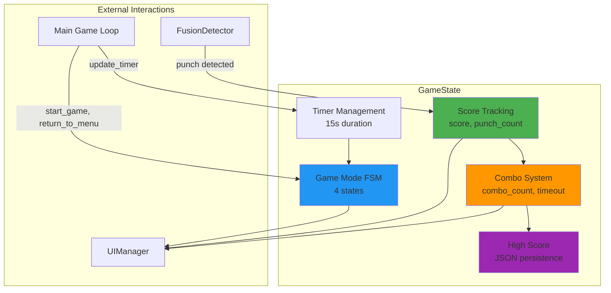
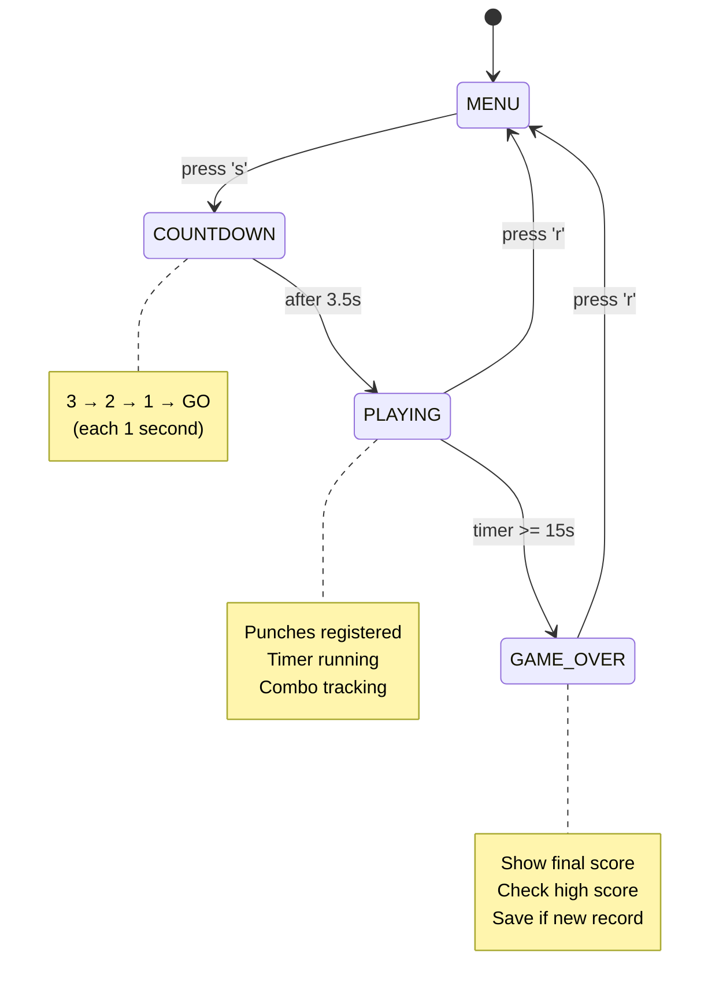
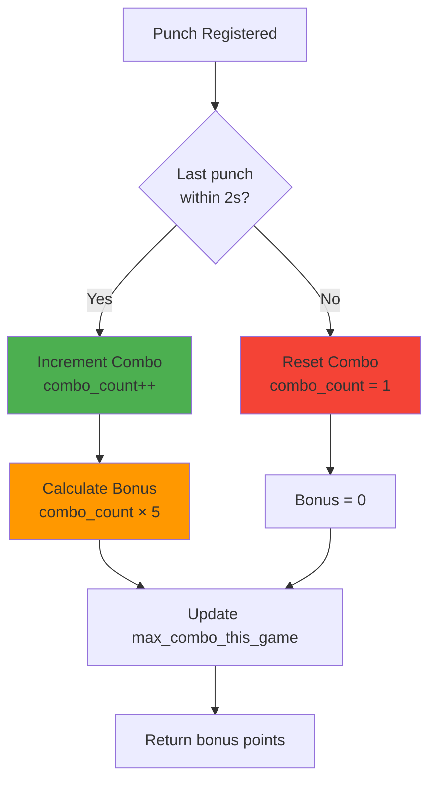
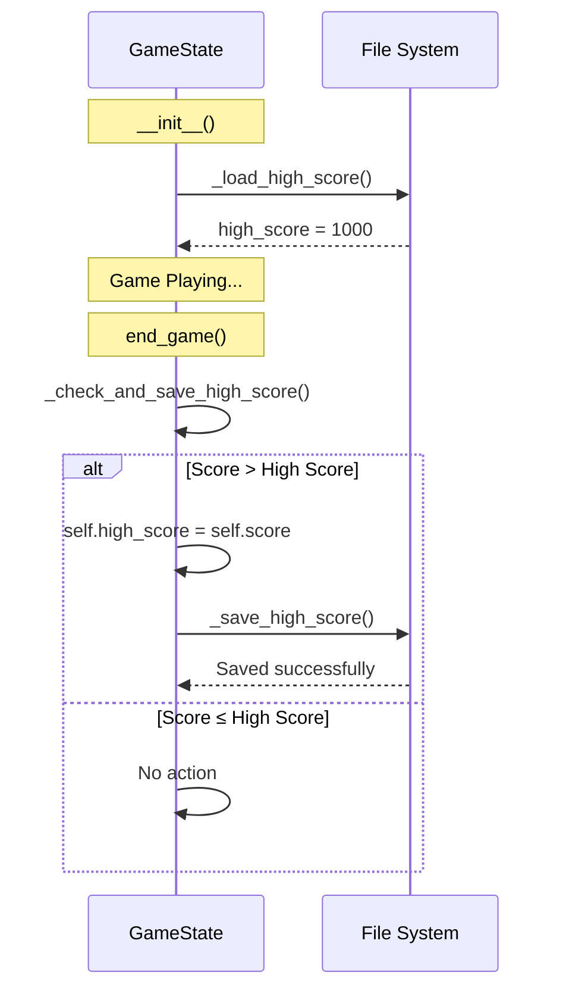
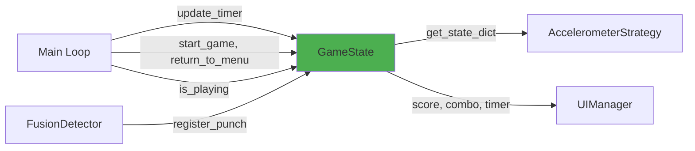

## Slide 39: GameState - Game Logic & Scoring

### **Purpose** (game_state.py:19-23)

Manages all game logic including scoring, combos, punch tracking, game modes, timer, and high score persistence.

### **Core Responsibilities**

```
1. Score Management
   └─ Base points + combo bonuses

2. Combo System
   └─ Track consecutive punches within timeout window

3. Game Mode State Machine
   └─ MENU → COUNTDOWN → PLAYING → GAME_OVER

4. Timer Management
   └─ 15-second game duration with countdown

5. High Score Persistence
   └─ Save/load from JSON file
```

### **Key Characteristics**

- **Stateful**: Single source of truth for game state
- **Self-contained**: No external dependencies (except config)
- **Persistent**: High scores saved between sessions

---

## Slide 40: GameState Architecture



---

## Slide 41: Game Mode State Machine

### **GameMode Enum** (game_state.py:12-17)

```python
class GameMode(Enum):
    MENU = "menu"          # Start screen, waiting for 's' key
    COUNTDOWN = "countdown" # 3-2-1-GO animation
    PLAYING = "playing"     # Active gameplay, punches counted
    GAME_OVER = "game_over" # End screen, show results
```

### **State Transitions**



### **State Check Methods** (game_state.py:203-217)

```python
is_playing()    → True only during PLAYING mode
is_game_over()  → True during GAME_OVER
is_menu()       → True during MENU
is_countdown()  → True during COUNTDOWN
```

---

## Slide 42: Score Calculation System

### **register_punch() Method** (game_state.py:49-84)

```python
def register_punch(self, punch_strength, timestamp=None):
    """
    Register punch and calculate score with combo bonuses.

    Args:
        punch_strength: 0.0-1.0 quality/strength score from FusionDetector
        timestamp: Optional timestamp (defaults to current time)

    Returns:
        dict: {
            'base_points': int,      # Base score from punch strength
            'combo_bonus': int,      # Additional points from combo
            'total_points': int,     # base_points + combo_bonus
            'new_score': int,        # Updated total score
            'combo_count': int,      # Current combo count
            'punch_count': int       # Total punches this game
        }
    """
```

### **Score Formula**

```
1. Base Points = punch_strength × BASE_SCORE_MULTIPLIER (100)
   └─ Range: 0-100 points per punch

2. Combo Bonus = combo_count × COMBO_BONUS_POINTS (5)
   └─ 1st punch: +0, 2nd: +10, 3rd: +15, 4th: +20, etc.

3. Total Points = Base Points + Combo Bonus
   └─ Added to cumulative score

4. Update: score += total_points
```

### **Example Calculation**

```
Punch 1: strength=0.8
├─ Base: 0.8 × 100 = 80 points
├─ Combo: 1 × 5 = 0 (first punch)
└─ Total: 80 + 0 = 80 points

Punch 2: strength=0.9 (within 2s of Punch 1)
├─ Base: 0.9 × 100 = 90 points
├─ Combo: 2 × 5 = 10 points
└─ Total: 90 + 10 = 100 points

Punch 3: strength=0.7 (within 2s of Punch 2)
├─ Base: 0.7 × 100 = 70 points
├─ Combo: 3 × 5 = 15 points
└─ Total: 70 + 15 = 85 points

Final Score: 80 + 100 + 85 = 265 points
Combo: 3x
```

---

## Slide 43: Combo System

### **Combo Logic** (game_state.py:86-111)

```python
def _update_combo_system(self, timestamp):
    """Update combo based on time between punches."""
    time_since_last = timestamp - self.last_punch_time

    if time_since_last < COMBO_TIMEOUT and self.last_punch_time > 0:
        # Continue combo: within timeout window
        self.combo_count += 1
        combo_bonus = self.combo_count * COMBO_BONUS_POINTS
    else:
        # Break combo: too much time elapsed
        self.combo_count = 1
        combo_bonus = 0

    # Track maximum combo achieved this game
    if self.combo_count > self.max_combo_this_game:
        self.max_combo_this_game = self.combo_count

    return combo_bonus
```

### **Combo Mechanics**



### **Configuration**

- **COMBO_TIMEOUT**: 2.0 seconds (window to maintain combo)
- **COMBO_BONUS_POINTS**: 5 points per combo level

### **Combo Tracking**

```python
combo_count        # Current active combo
max_combo_this_game # Highest combo achieved (for stats)
is_combo_active()   # True if combo_count > 1
```

---

## Slide 44: Timer Management

### **Timer Flow** (game_state.py:179-201)

```
Game Start (press 's'):
  ├─ game_mode = COUNTDOWN
  ├─ countdown_start_time = now
  └─ Wait for countdown completion

Countdown Complete (after 3.5s):
  ├─ game_mode = PLAYING
  ├─ game_start_time = now
  └─ game_timer = 0

Every Frame (update_timer):
  ├─ If mode == PLAYING:
  │   ├─ game_timer = now - game_start_time
  │   └─ If game_timer >= 15s:
  │       └─ end_game()

End Game:
  ├─ game_mode = GAME_OVER
  ├─ Check and save high score
  └─ Display results
```

### **Timer Methods**

```python
update_timer()          # Called every frame, checks for game over
get_remaining_time()    # Returns max(0, 15 - game_timer)
get_countdown_value()   # Returns 3, 2, 1, 0 (GO), or None

# Constants
game_duration = 15.0    # Total game time in seconds
```

### **Countdown Sequence** (game_state.py:219-235)

```
Elapsed Time | Display | State
-------------|---------|-------
0.0 - 1.0s   | "3"     | COUNTDOWN
1.0 - 2.0s   | "2"     | COUNTDOWN
2.0 - 3.0s   | "1"     | COUNTDOWN
3.0 - 3.5s   | "GO!"   | COUNTDOWN
3.5s+        | (none)  | PLAYING → start timer
```

---

## Slide 45: High Score Persistence

### **Persistence Implementation** (game_state.py:237-275)

```python
# File location
high_score_file = "game/high_score.json"

# JSON Format
{
    "high_score": 1250,
    "timestamp": 1730425600.123
}
```

### **Lifecycle**



### **Key Methods**

```python
_load_high_score()           # Load from JSON on startup
_check_and_save_high_score() # Compare and save if new record
_save_high_score()           # Write JSON to disk
get_high_score()             # Return current high score
is_new_high_score()          # Check if current == high score
```

### **Error Handling**

- **Load failure**: Defaults to `high_score = 0`
- **Save failure**: Logs error, continues game
- **Missing directory**: Creates `game/` directory if needed

---

## Slide 46: GameState Data Structure

### **State Variables** (game_state.py:25-46)

```python
# Score Tracking
self.score = 0                    # Cumulative score this game
self.punch_count = 0              # Total punches registered
self.combo_count = 0              # Current combo multiplier
self.last_punch_time = 0          # Timestamp of last punch
self.last_punch_score = 0         # Points from most recent punch
self.max_combo_this_game = 0      # Highest combo achieved

# Game Mode
self.game_mode = GameMode.MENU    # Current state
self.game_timer = 0               # Elapsed time in PLAYING mode
self.game_duration = 15.0         # Total game length
self.countdown_start_time = 0     # When countdown began
self.game_start_time = 0          # When PLAYING began

# Persistence
self.high_score = 0               # Loaded from file
self.high_score_file = "game/high_score.json"
```

### **State Dictionary Export** (game_state.py:122-135)

```python
def get_state_dict(self):
    """Used by SensorServer to broadcast to smartphone."""
    return {
        'score': self.score,
        'punch_count': self.punch_count,
        'combo_count': self.combo_count,
        'last_punch_score': self.last_punch_score,
        'last_punch_time': self.last_punch_time
    }
```

---

## Slide 47: GameState Integration

### **Called From Main Loop** (main.py)

```python
# Initialization
self.game_state = GameState()

# Timer Update (every frame)
self.game_state.update_timer()

# Punch Detection (when punch detected)
if self.game_state.is_playing():
    if is_punch:
        punch_result = self.game_state.register_punch(score, timestamp)
        self.event_manager.trigger_event('game_state_changed',
                                         self.game_state.get_state_dict())

# Keyboard Controls
if key == ord('s'):
    if self.game_state.is_menu():
        self.game_state.start_game()

if key == ord('r'):
    self.game_state.return_to_menu()
```

### **Used By Other Components**



---

## Slide 48: GameState Configuration

### **From game_config.py**

```python
# Scoring
BASE_SCORE_MULTIPLIER = 100   # Base points per punch (0-100)
COMBO_BONUS_POINTS = 5         # Additional points per combo level

# Timing
COMBO_TIMEOUT = 2.0            # Seconds to maintain combo
GAME_DURATION = 15.0           # Total game time (seconds)

# File Paths
HIGH_SCORE_FILE = "game/high_score.json"
```

### **Scoring Examples by Combo**

| Combo | Punch Strength | Base Points | Combo Bonus | Total |
| ----- | -------------- | ----------- | ----------- | ----- |
| 1x    | 0.5            | 50          | 0           | 50    |
| 2x    | 0.8            | 80          | 10          | 90    |
| 3x    | 0.9            | 90          | 15          | 105   |
| 5x    | 1.0            | 100         | 25          | 125   |
| 10x   | 0.7            | 70          | 50          | 120   |

**Max Theoretical Score (15s):**

- Assuming 30 punches with perfect strength (1.0) and max combo:
- `30 punches × (100 base + ~15 avg combo bonus) = ~3450 points`

---
