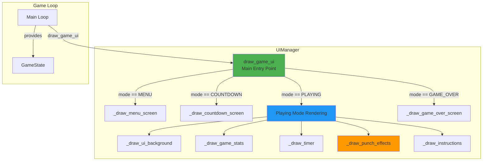
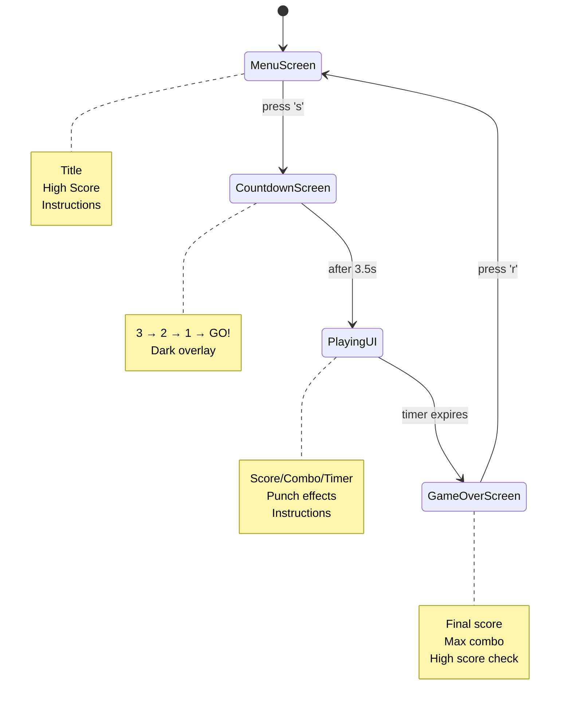
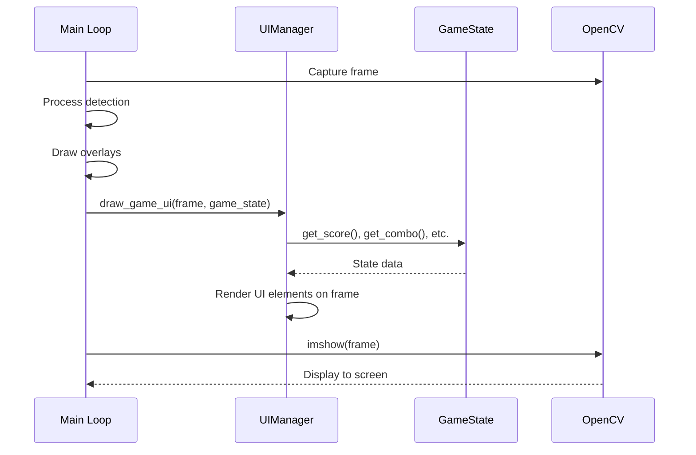

## Slide 49: UIManager - Visual Rendering System

### **Purpose** (ui_manager.py:11-15)

Manages all visual rendering including game stats, visual effects, multi-screen UI, and instructions. Separates rendering logic from game mechanics.

### **Core Responsibilities**

```
1. Multi-Screen Rendering
   └─ MENU, COUNTDOWN, PLAYING, GAME_OVER screens

2. Game Stats Display
   └─ Score, punches, combo, timer

3. Visual Effects
   └─ Punch flash effects and animations

4. Player Instructions
   └─ Contextual help text
```

### **Key Characteristics**

- **Stateless Rendering**: Receives GameState, renders output
- **Screen Management**: Adapts UI based on game mode
- **Effect Timing**: Manages temporary visual effects
- **In-Place Modification**: Draws directly on OpenCV frames

---

## Slide 50: UIManager Architecture



---

## Slide 51: Screen Routing Logic

### **draw_game_ui() Method** (ui_manager.py:22-49)

```python
def draw_game_ui(self, image, game_state):
    """Main entry point - routes to appropriate screen renderer."""
    height, width = image.shape[:2]

    # Route based on game mode
    if game_state.is_menu():
        self._draw_menu_screen(image, game_state, width, height)
    elif game_state.is_countdown():
        self._draw_countdown_screen(image, game_state, width, height)
    elif game_state.is_game_over():
        self._draw_game_over_screen(image, game_state, width, height)
    else:  # PLAYING mode
        self._draw_ui_background(image)
        self._draw_game_stats(image, game_state)
        self._draw_timer(image, game_state, width)
        self._draw_punch_effects(image, width, height)
        self._draw_instructions(image, game_state, height)
```

### **Screen Flow**



---

## Slide 52: Menu Screen

### **\_draw_menu_screen() Implementation** (ui_manager.py:118-159)

```
Layout:
┌─────────────────────────────────┐
│       PUNCH DETECTION GAME      │ ← Title (large, white)
│        High Score: 1250         │ ← Cyan color
│                                 │
│      Press 'S' to START         │ ← Green (highlighted)
│                                 │
│ Connect your smartphone to begin│
│ Punch as many times as you can  │
│         in 15 seconds!          │
│                                 │
│       Press 'Q' to QUIT         │ ← White
└─────────────────────────────────┘
```

### **Key Features**

- **Dark overlay**: 70% opacity black over camera feed
- **Centered text**: All text horizontally centered
- **High score display**: Shows persistent high score
- **Color coding**: Green for primary action (START)

### **Code Structure**

```python
# 1. Draw semi-transparent overlay
overlay = image.copy()
cv2.rectangle(overlay, (0, 0), (width, height), (0, 0, 0), -1)
cv2.addWeighted(overlay, 0.7, image, 0.3, 0, image)

# 2. Draw title
cv2.putText(image, "PUNCH DETECTION GAME", ...)

# 3. Show high score
cv2.putText(image, f"High Score: {game_state.get_high_score()}", ...)

# 4. Show instructions with color coding
```

---

## Slide 53: Countdown Screen

### **\_draw_countdown_screen() Implementation** (ui_manager.py:160-186)

```
Countdown Sequence:
┌─────────────────────────────────┐
│                                 │
│                                 │
│              3                  │ ← Large white (font_scale=4.0)
│                                 │
│                                 │
└─────────────────────────────────┘

... then "2", then "1", then:

┌─────────────────────────────────┐
│                                 │
│                                 │
│             GO!                 │ ← Green (font_scale=3.0)
│                                 │
│                                 │
└─────────────────────────────────┘
```

### **Implementation**

```python
countdown_value = game_state.get_countdown_value()

if countdown_value == 0:
    text = "GO!"
    color = (0, 255, 0)     # Green
    font_scale = 3.0
else:
    text = str(countdown_value)  # "3", "2", or "1"
    color = (255, 255, 255)      # White
    font_scale = 4.0

# Center text on screen
text_size = cv2.getTextSize(text, FONT_HERSHEY_SIMPLEX, font_scale, 5)[0]
text_x = (width - text_size[0]) // 2
text_y = (height + text_size[1]) // 2
```

### **Timing** (coordinated with GameState)

- 0.0-1.0s: "3"
- 1.0-2.0s: "2"
- 2.0-3.0s: "1"
- 3.0-3.5s: "GO!"
- 3.5s+: Transition to PLAYING mode

---

## Slide 54: Playing Mode UI

### **UI Components During Gameplay** (ui_manager.py:44-48)

```
Screen Layout:
┌─────────────────────────────────────────────┐
│ ┌────────────┐              Time: 12.3s     │ ← Timer (top-right)
│ │Score: 1250 │  Sensor: Connected          │
│ │Punches: 42 │  Accel: 18.5                │ ← Strategy UI (right)
│ │Combo: 5x   │                             │
│ └────────────┘                              │ ← UI Panel (top-left)
│                                             │
│         [Camera feed with pose overlay]     │
│                                             │
│                                             │
│ 1. Open smartphone web interface            │ ← Instructions (bottom)
│ 2. Start punching while holding phone       │    (only if punch_count==0)
│ 3. Face the camera for best results         │
└─────────────────────────────────────────────┘
```

### **Component Breakdown**

1. **UI Background Panel** (ui_manager.py:50-57)

   ```python
   # Black panel with white border
   cv2.rectangle(image, (10, 10), (410, 130), (0, 0, 0), -1)  # Filled
   cv2.rectangle(image, (10, 10), (410, 130), (255, 255, 255), 2)  # Border
   ```

2. **Game Stats** (ui_manager.py:59-72)

   ```python
   # Score (green, large)
   cv2.putText(image, f"Score: {score}", (20, 40), ..., (0, 255, 0))

   # Punches (white)
   cv2.putText(image, f"Punches: {count}", (20, 70), ..., (255, 255, 255))

   # Combo (cyan if active, white if not)
   color = (0, 255, 255) if combo > 1 else (255, 255, 255)
   cv2.putText(image, f"Combo: {combo}x", (20, 100), ..., color)
   ```

3. **Timer** (ui_manager.py:239-256)
   ```python
   # Color changes based on remaining time
   if remaining <= 5.0:  color = (0, 0, 255)      # Red
   elif remaining <= 10.0: color = (0, 165, 255)  # Orange
   else: color = (255, 255, 255)                  # White
   ```

---

## Slide 55: Punch Visual Effects

### **Effect System** (ui_manager.py:75-90)

```python
# Effect activation
def trigger_punch_effect(self):
    """Called when punch is detected."""
    self.punch_effect_timer = time.time()

# Effect rendering (every frame)
def _draw_punch_effects(self, image, width, height):
    current_time = time.time()
    if current_time - self.punch_effect_timer < 0.3:  # PUNCH_EFFECT_DURATION
        # Calculate fade-out alpha
        alpha = 1.0 - (current_time - self.punch_effect_timer) / 0.3

        # Green screen flash
        overlay = image.copy()
        cv2.rectangle(overlay, (0, 0), (width, height), (0, 255, 0), -1)
        cv2.addWeighted(overlay, alpha * 0.3, image, 1.0, 0, image)

        # "PUNCH!" text (centered)
        cv2.putText(image, "PUNCH!", (center_x, center_y),
                   FONT_HERSHEY_SIMPLEX, 2, (0, 0, 255), 3)
```

### **Effect Timeline**

```mermaid
gantt
    title Punch Effect Animation (300ms)
    dateFormat X
    axisFormat %Lms

    section Screen Flash
    Full intensity (alpha=0.3) :0, 50
    Fade out (alpha 0.3→0)     :50, 300

    section PUNCH Text
    Display "PUNCH!"           :0, 300
    Remove                     :300, 301
```



### **Visual Result**

```
t=0ms:    Green flash (30% opacity) + "PUNCH!" text
t=150ms:  Green flash (15% opacity) + "PUNCH!" text
t=300ms:  Effect ends, normal display resumes
```

---

## Slide 56: Game Over Screen

### **\_draw_game_over_screen() Implementation** (ui_manager.py:187-238)

```
Layout (New High Score):
┌─────────────────────────────────┐
│         TIME'S UP!              │ ← Red, large (font_scale=2.0)
│     NEW HIGH SCORE!             │ ← Green, animated (if applicable)
│                                 │
│     FINAL SCORE: 1450           │ ← White
│     Total Punches: 48           │
│     Max Combo: 12x              │
│                                 │
│     High Score: 1450            │ ← Cyan
│                                 │
│    Press 'R' to RESTART         │ ← Green
└─────────────────────────────────┘
```

### **Key Features**

1. **High Score Detection** (ui_manager.py:203-209)

   ```python
   if game_state.is_new_high_score():
       cv2.putText(image, "NEW HIGH SCORE!", ..., (0, 255, 0))
   ```

2. **Final Statistics Display**

   ```python
   stats = [
       f"FINAL SCORE: {game_state.get_score()}",
       f"Total Punches: {game_state.get_punch_count()}",
       f"Max Combo: {game_state.max_combo_this_game}x",
       "",
       f"High Score: {game_state.get_high_score()}"
   ]
   ```

3. **Color Coding**
   - Title: Red (urgency)
   - New record: Green (celebration)
   - High score: Cyan (info)
   - Restart: Green (call to action)

---

## Slide 57: Dynamic Instructions

### **Contextual Help System** (ui_manager.py:92-103)

```python
def _draw_instructions(self, image, game_state, height):
    """Show instructions only before first punch."""
    if game_state.get_punch_count() == 0:
        instructions = [
            "1. Open smartphone web interface",
            "2. Start punching while holding phone",
            "3. Face the camera for best results"
        ]

        for i, instruction in enumerate(instructions):
            y_pos = height - 80 + i * 25
            cv2.putText(image, instruction, (20, y_pos),
                       FONT_HERSHEY_SIMPLEX, 0.5, (255, 255, 0), 1)
```

### **Logic**

```
if punch_count == 0:
    Show instructions (new player)
else:
    Hide instructions (player understands mechanics)
```

### **Rationale**

- **Reduces clutter**: Experienced players don't need instructions
- **Helps newcomers**: First-time players get guidance
- **Automatic removal**: Disappears after first successful punch

---

## Slide 58: Color Configuration

### **Color Constants** (game_config.py:23-30)

| Constant                    | RGB Value         | Usage                           |
| --------------------------- | ----------------- | ------------------------------- |
| `SCORE_COLOR`               | `(0, 255, 0)`     | Score display (green = success) |
| `NORMAL_TEXT_COLOR`         | `(255, 255, 255)` | General text (white)            |
| `COMBO_COLOR`               | `(0, 255, 255)`   | Active combo (cyan = special)   |
| `PUNCH_TEXT_COLOR`          | `(0, 0, 255)`     | "PUNCH!" effect (red = alert)   |
| `INSTRUCTION_COLOR`         | `(255, 255, 0)`   | Help text (yellow = info)       |
| `SENSOR_CONNECTED_COLOR`    | `(0, 255, 0)`     | Connected status (green = OK)   |
| `SENSOR_DISCONNECTED_COLOR` | `(0, 0, 255)`     | Disconnected (red = error)      |

### **Color Psychology**

- **Green**: Success, positive actions, connected
- **Red**: Alerts, time pressure, disconnected
- **Cyan**: Special states (combo, high score)
- **Yellow**: Informational, guidance
- **White**: Neutral, standard text

---

## Slide 59: UIManager Integration

### **Called From Main Loop** (main.py:121)

```python
# Every frame, after all detection and drawing overlays
self.ui_manager.draw_game_ui(frame, self.game_state)

# When punch detected
if is_punch:
    self.register_punch(score, timestamp)
    self.ui_manager.trigger_punch_effect()  # Activate visual effect

# Display final frame
cv2.imshow('Punch Detection Game', frame)
```

### **Data Flow**



---

## Slide 60: UIManager State Management

### **Internal State** (ui_manager.py:17-20)

```python
def __init__(self):
    self.punch_effect_timer = 0              # Timestamp of last effect trigger
    self.punch_effect_duration = 0.3         # Effect duration (seconds)
```

### **State is Minimal**

- **Only tracks effects**: Punch flash timing
- **No game logic**: All game data comes from GameState
- **Stateless rendering**: Given same GameState, produces same output

### **Why Minimal State?**

```
✓ Easy to test: Predictable output based on inputs
✓ No side effects: Rendering doesn't change game state
✓ Simple debugging: Effect timer is only mutable state
✓ Clear separation: UI doesn't "know" about game rules
```

---

## Slide 61: UIManager Design Benefits

### **Architectural Advantages**

1. **Separation of Concerns**

   - UI rendering completely separate from game logic
   - GameState owns data, UIManager owns visualization
   - Changes to scoring don't require UI changes

2. **Modularity**

   - Each screen has its own render method
   - Easy to add new screens or modify existing ones
   - Components can be tested independently

3. **Performance**

   - In-place rendering on OpenCV frames (no copying)
   - Efficient overlay blending for effects
   - Minimal state tracking

4. **Maintainability**

   - All colors defined in config (easy theme changes)
   - Text positions calculated (responsive to resolution)
   - Clear method naming (\_draw_X_screen)

5. **User Experience**
   - Context-aware UI (instructions disappear after first punch)
   - Visual feedback (punch effects, combo highlighting)
   - Color-coded information hierarchy
