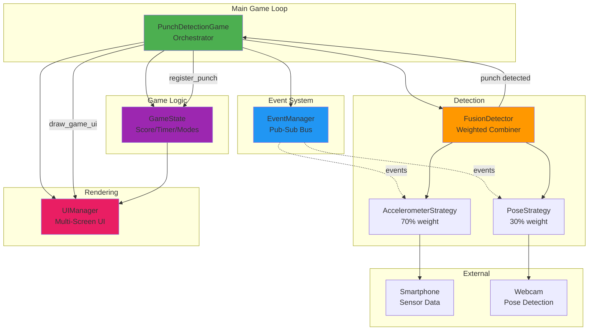

## Slide 62: Complete System Summary

### **Full Architecture Integration**



---

## Slide 63: Project Structure Summary

### **Module Organization**

```
proj-game-klai-kriad/
├── main.py                          # Entry point, main game loop
├── detection/
│   ├── detection_config.py          # Detection thresholds & weights
│   ├── base_strategy.py             # Abstract strategy interface
│   ├── fusion_detector.py           # Weighted strategy combiner
│   ├── accelerometer/
│   │   ├── accelerometer_strategy.py # Smartphone sensor detection
│   │   ├── sensor_server.py          # Flask/SocketIO server
│   │   └── motion_analyzer.py        # Acceleration analysis
│   └── pose/
│       ├── pose_strategy.py          # MediaPipe vision detection
│       └── pose_analyzer.py          # Landmark analysis
├── game/
│   ├── game_config.py               # UI colors, timing, scoring
│   ├── event_manager.py             # Pub-sub event system
│   ├── game_state.py                # Score, combo, timer, modes
│   └── ui_manager.py                # All visual rendering
└── templates/
    └── index.html                   # Smartphone web interface
```

### **Design Patterns Used**

- **Strategy Pattern**: Pluggable detection strategies
- **Observer Pattern**: Event-driven communication
- **State Machine**: Game mode transitions
- **Facade Pattern**: UIManager simplifies rendering
- **Separation of Concerns**: Detection ↔ Logic ↔ UI

---

## Slide 64: Key Takeaways

### **1. Modular Architecture**

Each module has a single responsibility and clear interfaces:

- **Detection strategies** process input data independently
- **FusionDetector** combines results without knowing implementation details
- **GameState** manages logic without rendering concerns
- **UIManager** renders without game rules knowledge

### **2. Event-Driven Communication**

Components communicate through events, not direct references:

- Enables loose coupling and extensibility
- Strategies can be added without modifying existing code
- Error isolation prevents cascading failures

### **3. Weighted Sensor Fusion**

Combines multiple input sources with configurable weights:

- Accelerometer (70%): Primary signal for force measurement
- Pose (30%): Visual confirmation prevents false positives
- Adaptive logic based on orientation detection

### **4. Progressive Enhancement**

System remains functional even if components fail:

- Game works with only accelerometer or only pose
- Instructions appear/disappear based on player experience
- Graceful degradation when sensors disconnect

### **5. Configuration Over Code**

All tunable parameters externalized to config files:

- Easy adjustment of detection thresholds
- UI colors and layout configurable
- No code changes needed for sensitivity tweaks

---

**End of Presentation**

_This document provides a comprehensive technical overview of the Punch Detection Game implementation, covering all major architectural components and design decisions._
